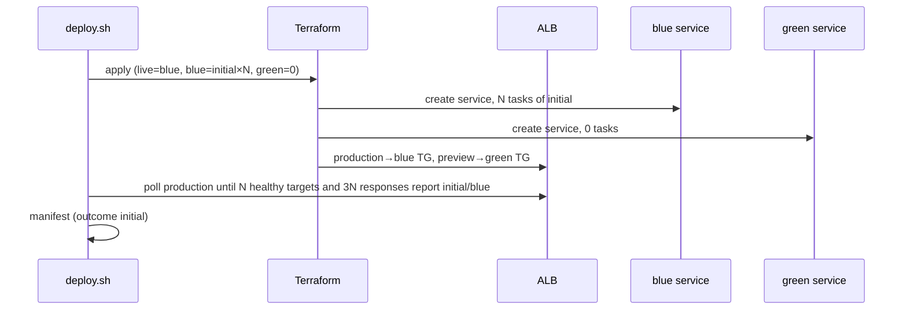
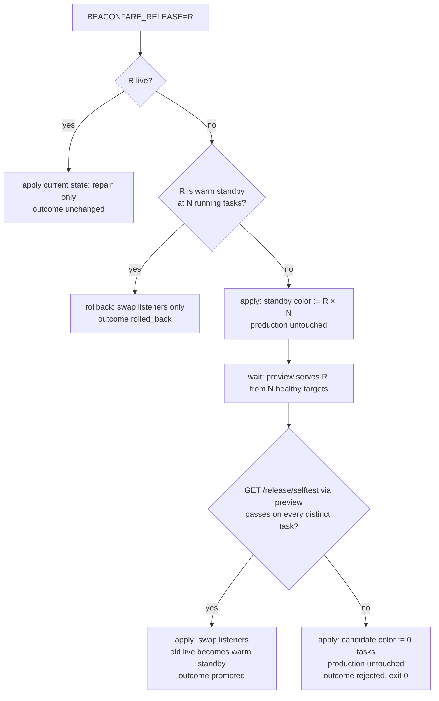
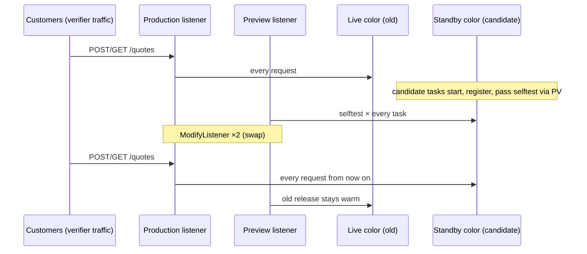

# BeaconFare Release Cutover — Reasoning

## Introduction

BeaconFare prices freight lanes and stores every issued quote. The product
problem is not the API; it is **shipping a new release of it safely**. A
previous release with a rounding regression reached customers because it
was perfectly healthy. The platform the model builds must therefore:

- stage every candidate release next to production, on real infrastructure;
- prove it through a **preview listener** before any customer request reaches it;
- switch customers over without failing a single request;
- keep the previous release warm so a rollback is a listener change;
- reject a candidate that fails its proof, automatically, with production untouched.

Three images are supplied, one per release (3.4.0, 3.5.0, 3.6.0). The
version and pricing build are baked in at build time, so nothing in a task
definition can alter them. The runtime picks, per environment, which of
3.5.0 and 3.6.0 is built with the `legacy_floor` pricing regression. The
model sees the choice in its own environment only by running the self-test;
the verifier makes a fresh choice, so hard coding "3.6.0 is bad" fails half
the time and skipping verification fails always.

The application exists to make the release mechanics observable. Every
response carries `X-BeaconFare-Version`, `X-BeaconFare-Color` and
`X-BeaconFare-Task`, so the verifier can say exactly which release, color and
task answered each production request during a release. `GET
/release/selftest` prices four reference lanes and round-trips a probe item
through DynamoDB; the defective build fails it while `/health/ready` stays
`200`. That gap between *healthy* and *correct* is the core of the task.

The model writes `infra/*.tf`, a `deploy.sh` that acts as a release
controller driven by `BEACONFARE_RELEASE`, a `destroy.sh`, and a manifest.

## Infrastructure Used

| Service | Job in this system | What connects to it |
|---|---|---|
| **VPC** (2 public, 2 private subnets, IGW, route tables, security groups) | Public ALB subnets and private task subnets. SGs are declared (ALB admits both listener ports; tasks admit 8080 from the ALB SG only) but not enforced by the emulator, so they are checked as declarations. | ALB, both ECS services |
| **Application Load Balancer** | One internet-facing ALB with two listeners. **Production** forwards to the live color, **preview** to the standby color. Promotion and rollback are in-place listener modifications that swap the two. | Clients, verifier, `deploy.sh` (self-test via preview) |
| **Target groups** (blue, green) | One `ip` target group per color on 8080 with `/health/ready`. Target health tells the controller when a color's tasks are registered and ready. | ALB listeners, ECS services |
| **ECS cluster + two Fargate services** | The blue and green colors. Each runs one release at a time, selected by task definition, at `api_desired_count` or `0` tasks depending on the release state. Tasks set `DEPLOYMENT_COLOR`. | Target groups, DynamoDB |
| **ECS task definitions** | One per color × release. The emulator does not echo container definitions back, so they sit under `ignore_changes`; a release therefore selects its own definition instead of mutating one. | ECS services |
| **DynamoDB** (quotes table, TTL on `expires_at`) | Durable store shared by both colors and every release. Proves quotes written during a cutover survive it and that the self-test's storage round trip works. | Every task |
| **IAM** (execution role, task role) | Execution role ships logs only; one task role for every release with four DynamoDB actions on the quotes table only. Declaration-checked. | ECS task definitions |
| **CloudWatch Logs** | One `/ecs/<family>` group per task definition family with the configured retention. The endpoint always writes container output there and auto-creates the group if missing, so an unmanaged one leaks past destroy. | ECS task definitions |

Emulator facts the design rests on (all published in `runtime.md`):
Terraform updates to an existing service's `desired_count` are not applied
(created counts and CLI `update-service --desired-count` are), so capacity
belongs to the release controller while Terraform owns everything else —
the same split real teams use when something outside Terraform scales a
service;
ECS deployments are simplified — no circuit breaker, no min/max percent, no
automatic rollback — so the safety net has to be built by the model, not
configured; each listener port is its own socket on the endpoint host;
container definitions are not read back in the registered shape.

## Operational Flows

### 1. First deployment

### 2. Candidate release: verify, then promote or reject

### 3. Production during a promotion

### 4. Rollback and repair

Rollback is flow 2's middle branch: the listeners swap back onto the tasks
that were already running, and the verifier proves it by comparing task ARNs
before and after. Repair deletes the preview listener and the standby ECS
service; a `deploy.sh` run with no release requested re-applies the recorded
state, which recreates both without touching the live service or the
production listener.

### 5. State

`deploy.sh` keeps `live_color`, `color_release` and `color_count` in
`infra/release.auto.tfvars.json`. That file is the durable record between
runs and is auto-loaded, so the verifier's standalone `plan -refresh=false`
agrees with the last run. Leftover release state without Terraform state
(from the agent's own testing) is discarded on the first verifier run.

## Score

Fourteen obligations, 100 points. Only 100 passes.

### v0.8.0: side-effect-free refusals and recovery invariants

Realm task version 15 (v0.7.2) still let five of six non-Astra runs reach
100. The one failure (GPT 6 SOL, run `21dc7a7e`, 80) missed exactly the
behaviours a production release controller must get right when it decides
*not* to act: a refused run under a live lease and an unknown-release run
both started or stopped tasks, and its drift recovery left the standby
unready. v0.7.2 published those rules loosely ("exit non-zero without
changing anything", one 1-point check). v0.8.0 makes them a precise public
contract (*Refusals* in `release-process.md`) and checks every clause:

- exact exit statuses: `64` for an unknown release (exact, case-sensitive
  match), `75` for a live foreign lease, with the request validated
  **before** the lock is read: an unknown release under a live lease is `64`
  and the lease is untouched;
- bounded: every refusal returns within 30 seconds (was 60);
- side-effect-free: no submission file, Terraform state, manifest, listener,
  ECS desired count or task definition, live task or lock item changes;
- **repairs nothing**: under a live lease, a no-release run must leave a
  drifted standby count and a drifted preview listener exactly as found;
- recovery invariant: once the lease is gone, the next run restores the
  recorded state as if the refusals never happened.

All of it is deterministic: the verifier plants the lease rows and the drift
itself, and no check depends on two deploys racing.

### Calibration history

Task v3 passed 4 of 5 scored panel runs with no false results: the release
algorithm was fully specified and nothing in the environment punished a
shallow implementation of it. v4 adds two fully published requirements that
real release controllers must get right:

- **Warm-up.** Every release image warms up for a randomized 20–35 s after
  start (fixed per environment, not published). Until then `/health/ready`,
  `/release/selftest` and `POST /quotes` answer `503 warming_up`, which the
  contract states is not a verdict. Gating on "tasks running" or reading the
  first non-200 self-test as a failure rejects a correct release.
- **Recorded state is the truth.** Operators can change listeners and task
  counts out of band; a no-release deploy restores the recorded state
  without failing a request (`lifecycle.drift_restored`).

Realm task version 3 (v0.6.0, git tag `realm-task-v3-0.6.0`) still swept the
panel: non-Astra 100s from Gemini ×2, GPT 5.6 ×1 and Opus ×1, with the other
runs at 94 and 84 and no false results. Two causes, both fixed in v0.7.0:

- **The contract handed over the reference controller.** A public
  `execution-guide.md` spelled out the reference's phase machine step by
  step (record file, count restore, listener read-back, proof loop, rejection
  path). Every normative fact in it is also stated in `release-process.md`,
  `runtime.md` or `services/iam.md`, so it was removed without creating a
  hidden requirement. The model now designs the controller from the rules.
- **No concurrency control.** Real release controllers serialize. v0.7.0
  adds a published exclusive release lock (`release-lock.md`): a DynamoDB
  lease taken before any change, respected (exit `75`, nothing changed)
  while another holder's lease is live, taken over when expired, held for the
  run and released on every exit (`lifecycle.exclusive_release_lock`). The
  verifier plants the lease rows itself, so the test runs no concurrent
  deploys and has no timing race.

### Verified promotion and defective-release rejection — 24

| Obligation | Pts | What it proves |
|---|---:|---|
| `lifecycle.zero_downtime_promotion` | 12 | Under continuous POST/GET traffic, a correct release is promoted with **zero** failed production requests and a single changeover; afterwards production serves it from the other color, preview serves the old release, and the old live task ARNs are unchanged (warm standby). Quotes written before/during read back, and quotes issued before the cutover retain their original fare and `priced_by` release. Manifest says `promoted`. |
| `lifecycle.defective_release_rejected` | 12 | The regression release is requested under traffic. `deploy.sh` exits 0; no production response ever reports it (gate `lifecycle.no_defective_traffic`, cap **39**); live tasks are identical before/after; the candidate color ends at 0 tasks; manifest says `rejected`. A later correct release must then stage from that zero-capacity color, pass proof, and promote without replacing the original live tasks. |

### Exclusive release lock and side-effect-free refusals — 19

| Obligation | Pts | What it proves |
|---|---:|---|
| `lifecycle.exclusive_release_lock` | 9 | No lock item is left by earlier runs. The verifier plants an **expired** lease (holder `crashed-controller`) and requests the defective release under traffic: the run must replace it with one lease of its own (`lease_expires_at` = acquisition + `lock_lease_seconds`), hold it for the whole run, reject the candidate, and delete its lock at the end. Then it plants a **live** lease (holder `operator-maintenance`) and requests a candidate: `deploy.sh` must exit `75` within 30 s having changed no submission file, no routing and no task, and leaving the foreign lock byte-for-byte intact. |
| `lifecycle.refusals_side_effect_free` | 10 | Two unknown releases (`9.9.9` and the near miss `v<good release>`) must each exit `64` within 30 s. With a live foreign lease planted, an unknown release must still exit `64` (validation precedes the lock) and leave the lease intact. Then the verifier drifts the standby's desired count and points the preview listener at the live color, and a no-release run under the live lease must exit `75` within 30 s and **repair none of it**. No refused run may change a submission file, the manifest, a listener, an ECS desired count or task definition, a live task or the lock item, and no production request may fail. Finally the lease is removed and a no-release run must restore the recorded routing and standby count without touching live tasks (outcome `unchanged`). |

### Instant rollback, drift and repair, stable state — 23

| Obligation | Pts | What it proves |
|---|---:|---|
| `lifecycle.instant_rollback` | 8 | Requesting the warm standby's release swaps production onto **exactly** the standby task ARNs (nothing new started), with zero failed requests; preview then serves the release that was live, still warm. |
| `lifecycle.drift_restored` | 8 | With a warm pair, the verifier swaps the two listeners and scales the standby to 1 task outside `deploy.sh` (and first proves production now serves the standby release). A no-release deploy must put production and preview back on the **recorded** colors and the standby back to its recorded count, with zero failed requests and live tasks untouched. A controller that reads "which color is live" from the listeners adopts the drift. |
| `lifecycle.repair_without_disruption` | 5 | Preview listener and standby service are deleted; a no-release deploy restores both, preview forwards to standby, no production request fails, no live task is replaced. |
| `lifecycle.reapply_stable` | 2 | A standalone `terraform plan -refresh=false` resolves every variable and plans no create/delete. |

### Blue/green topology — 11

| Obligation | Pts | What it proves |
|---|---:|---|
| `declared.release_topology` | 5 | In state: both listeners on the configured ports, each forwarding to exactly one, different color TG; both TGs `ip` with `/health/ready`; both services private, no public IP, own TG; their task definitions use a supplied image and the right `DEPLOYMENT_COLOR`. |
| `realized.initial_release` | 6 | Live: production→one color, preview→the other; live color has N healthy targets and N running tasks, standby 0; every production response is initial/live color from >1 task; manifest says `initial`. |

### Product traffic — 4

| Obligation | Pts | What it proves |
|---|---:|---|
| `observed.quotes_roundtrip` | 4 | Fresh quotes are issued by the live release (`priced_by` equals the serving version), read back unchanged, and exist in the manifest's table. Fare values are never asserted: pricing correctness belongs to the release's self-test, not the verifier. |

### Managed platform and isolation — 11

| Obligation | Pts | What it proves |
|---|---:|---|
| `declared.managed_iac` | 4 | Gate. Every scored resource family is in state and the manifest's ARNs resolve to state. |
| `declared.identity_data_logs` | 7 | Quotes table key/billing/TTL; release lock table `<prefix>-release-lock` keyed on `lock_id` (S), on-demand; execution role logs-only; task role four actions on the quotes table only; no wildcards; a managed `/ecs/<family>` group with exact retention for every task definition family (the endpoint ignores `awslogs-group` and writes there). Declaration only for IAM. |

### Destruction — 8

| Obligation | Pts | What it proves |
|---|---:|---|
| `lifecycle.destroy_clean` | 8 | Gate `lifecycle.baseline_preserved`, cap **79** on leak. Nothing carrying the prefix remains; the pre-existing `<prefix>-legacy-*` table, cluster and log group are untouched. |

### Gates and caps

- `declared.managed_iac` failing means the declared plane is unproven.
- Serving the defective release caps the total at 39: a pipeline that ships
  mispriced freight is not a partial success.
- Deleting or leaking resources caps at 79.

### Why wrong designs fail

| Design | Fails |
|---|---|
| Single service, update task definition in place | topology, promotion (no standby, tasks replaced), rollback, rejection (regression goes live → cap 39) |
| Blue/green but promote on target health | rejection → cap 39 |
| One `terraform apply` that swaps listeners in the same run it stages the candidate | promotion is unverified; rejection → cap 39 |
| Change image inside one task definition per color | image change ignored after first apply; promotion never changes version |
| Redeploy previous release instead of swapping | rollback (new task ARNs) |
| Gate on running count or treat `503 warming_up` as a failed self-test | promotion (correct release rejected) |
| Derive the live color from the listeners instead of recorded state | drift (drift adopted) |
| Ignore the release lock, or check it only after `terraform apply` | lock (a live lease does not stop the run) |
| Treat any existing lock item as held, or delete a foreign lock | lock (an expired lease is not taken over, or the operator's lease is destroyed) |
| Acquire the lock but never release it on rejection | lock (lock left behind) |
| Take the lock (or apply) before validating the requested release | refusals (`75` instead of `64`, or mutation) |
| Repair drift or run `terraform apply` before checking the lock | refusals (a refused run repaired drift) |
| Release state kept only in memory or a temp file | rollback/repair pick the wrong color; standalone plan shows changes |
| `-var` flags only inside deploy.sh | standalone plan fails |
| Destroy by name prefix | legacy decoys deleted → cap 79 |
